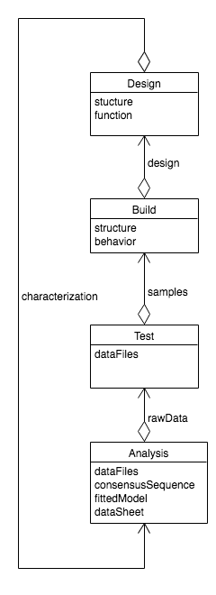
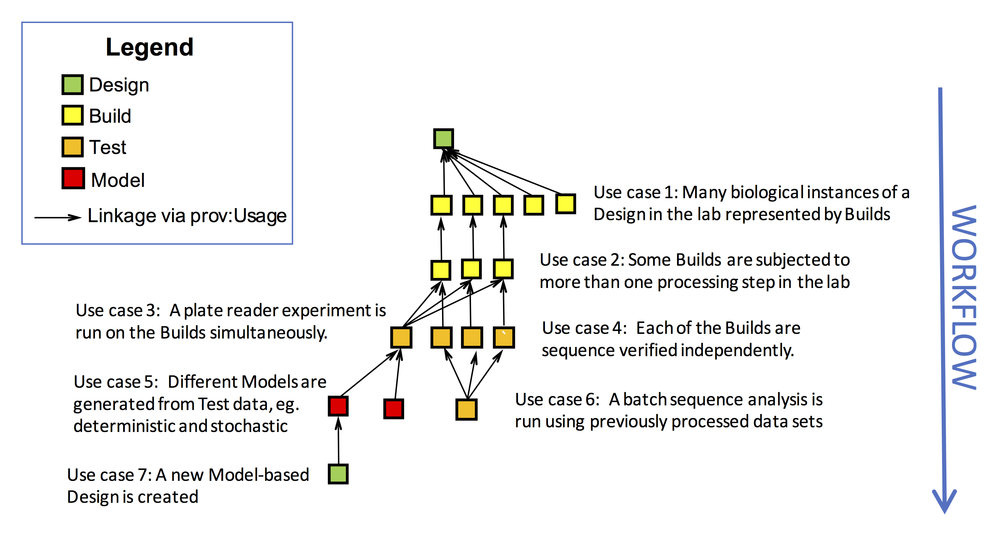

Design-Build-Test-Learn Workflows
=================================

PySBOL2 can be used to manage computational and experimental workflows for synthetic biology. The API is based on the design-build-test-learn (DBTL) method for engineering problem solving. These workflows involve the following types of objects:

* A ``Design`` is a conceptual representation of a biological system that a synthetic biologist intends to implement in the lab. A ``Design`` may describe both structural composition or the intended function of a biological system. In more traditional engineering terms, a ``Design`` is analogous to a draft or blueprint, but is a purely digital representation
* A ``Build`` describes an actual, physical sample in the laboratory. A DNA construct is the most common example of a ``Build`` in synthetic biology, but the definition can be extended to represent any kind of physical sample, including cells and reagents. A ``Build`` may be linked to a laboratory information management system using SBOL.
* A ``Test`` is a wrapper for experimental data files that are produced as a result of an experimental measurement on a ``Build``. As a matter of scientific integrity, unaltered experimental data should and must be preserved. A ``Test`` object provides a link to those data.
* An ``Analysis`` is a wrapper for experimental data that has been processed or transformed. Common data transformations include subtracting background signal ("blanking"), log transformations, and model-fitting.

Note that these pySBOL2 classes are not part of the core SBOL standard, but are abstractions provided by the pySBOL2 interface for the convenience of the user. However, they map closely to the SBOL data model. 

In order to organize and track data as a workflow proceeds, a user can create objects and link them together using ``Activity`` objects. An ``Activity`` uses certain types of objects as inputs and generates new objects. For example, under the DBTL formalization a ``Design`` is used to generate a ``Build``. This implies that a digital blueprint for a biological system has been realized as a real construct the laboratory. If an experimental measurement is performed subsequently, via an experiment ``Activity``, a ``Test`` object is generated. A ``Test`` performs measurement on ``Builds``. Finally an ``Analysis`` may use the raw experimental data represented by a ``Test`` object. Thus, objects are created in a logical order that conforms to the DBTL formalism.  This pattern is represented in the UML class diagram below.

An ``Activity`` is executed by an ``Agent`` which may be a person, a piece of software, or laboratory robotics. The ``Agent`` executes a ``Plan`` which may be a laboratory protocol written in natural language or a set of automated instructions. The classes ``Activity``, ``Agent``, and ``Plan`` are all defined according the Provenance Ontology (PROV-O). The pySBOL API provides the ``Design``, ``Build``, ``Test``, and ``Analysis`` classes to simplify workflow representation. However, it is also possible to use the API to construct PROV-O workflows that conform to other patterns.

The usage pattern described above can be summarized as follows: An ``Activity`` may use one or more objects of type X to generate one or more objects of type Y that come next in the DBTL workflow. Additionally DBTL workflows can be cyclic. An ``Analysis`` may generate a ``Design``. In this pattern, the ``Analysis`` represents a specification or prediction that is assumed to be true about the ``Design`` since it has been previously experimentally verified. Such a pattern is called a DBTL cycle. 

The DBTL cycle is a generalized, iterative framework for engineering problem-solving---something like a scientific method for engineers. In the context of synthetic biology, the DBTL cycle may include processes such as pulling data about biological parts from online databases, assembling new genetic programs from DNA sequences, synthesizing and assembling DNA, performing quality control, measurement and model-based characterization of a DNA part's encoded behavior, submitting characterized parts to inventories, and publishing data sheets. Ideally, each cycle generates new knowledge that feeds back into new cycles in the form of alternative approaches, reformulated problems, or forward specifications for future designs.

In addition to the logical workflow order described above, other simple workflow patterns are allowed as well. An ``Activity`` that generates an object of type X may use other objects also of type X as inputs. For example a laboratory construct may go through sequential stages of processing before the target ``Build`` is complete. Examples are enzymatic treatment, DNA purification, and transformation. At each stage, a ``Build`` uses a prior ``Build``. Therefore ``Builds`` may use prior ``Builds`` as well as ``Designs``.

Branching and intersecting workflows are other common patterns of usage. For example, an intersecting workflow occurs when a construct is assembled out of multiple physical components, such as occurs when a Gibson assembly uses multiple DNA samples. Multiple ``Build`` inputs are used to generate the new ``Build``. Another kind of intersecting workflow occurs when an experimental ``Test`` is performed on multiple ``Build`` samples. Conversely, branching patterns may also occur. For example, a branching workflow occurs when transformation of a single Gibson reaction mixture generates multiple clones, each of which may be subjected to their own unique history of subsequent testing and analysis.

.. code:: python

	from sbol2 import *

	doc=Document()
	setHomespace('https://sys-bio.org')

	doc = Document()

	workflow_step_1 = Activity('build_1')
	workflow_step_2 = Activity('build_2')
	workflow_step_3 = Activity('build_3')
	workflow_step_4 = Activity('build_4')
	workflow_step_5 = Activity('build_5')
	workflow_step_6 = Activity('test_1')
	workflow_step_7 = Activity('analysis_1')

	workflow_step_1.plan = Plan('PCR_protocol_part1')
	workflow_step_2.plan = Plan('PCR_protocol_part2')
	workflow_step_3.plan = Plan('PCR_protocol_part3')
	workflow_step_4.plan = Plan('gibson_assembly')
	workflow_step_5.plan = Plan('transformation')
	workflow_step_6.plan = Plan('promoter_characterization')
	workflow_step_7.plan = Plan('parameter_optimization')

	setHomespace('')
	Config.setOption(ConfigOptions.SBOL_COMPLIANT_URIS, False)  # Temporarily disable auto-construction of URIs

	workflow_step_1.agent = Agent('mailto:jdoe@sbols.org')
	workflow_step_2.agent = workflow_step_1.agent
	workflow_step_3.agent = workflow_step_1.agent
	workflow_step_4.agent = workflow_step_1.agent
	workflow_step_5.agent = workflow_step_1.agent
	workflow_step_6.agent = Agent('http://sys-bio.org/plate_reader_1')
	workflow_step_7.agent = Agent('http://tellurium.analogmachine.org')

	Config.setOption(ConfigOptions.SBOL_COMPLIANT_URIS, True)
	setHomespace('https://sys-bio.org')

	doc.addActivity([workflow_step_1, workflow_step_2, workflow_step_3, workflow_step_4, workflow_step_5, workflow_step_6, workflow_step_7])

	target = Design('target')
	part1 = workflow_step_1.generateBuild('part1', target)
	part2 = workflow_step_2.generateBuild('part2', target)
	part3 = workflow_step_3.generateBuild('part3', target)
	gibson_mix = workflow_step_4.generateBuild('gibson_mix', target, [part1, part2, part3])
	clones = workflow_step_5.generateBuild(['clone1', 'clone2', 'clone3'], target, gibson_mix)
	experiment1 = workflow_step_6.generateTest('experiment1', clones)
	analysis1 = workflow_step_7.generateAnalysis('analysis1', experiment1)

	response = doc.write('dbtl.xml')
	print(response)

.. end

 

