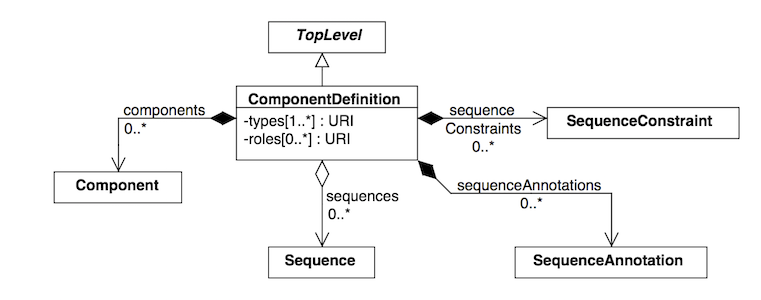

Getting Started with pySBOL3
=============================

This beginner’s guide introduces the basic principles of pySBOL3 for
new users. The examples discussed in this guide are excerpted
from the Jupyter notebook (`pySBOL3/examples/getting_started.ipynb <https://github.com/SynBioDex/pySBOL3/tree/main/examples/getting_started.ipynb>`_). 
The objective of this documentation is to
familiarize users with the basic patterns of the API. For more
comprehensive documentation about the API, refer to documentation
about specific classes and methods.

The class structure and data model for the API is based on the
Synthetic Biology Open Language. For more detail about the SBOL
standard, visit `sbolstandard.org <https://sbolstandard.org>`_ or
refer to the `specification document
<https://sbolstandard.org/datamodel-specification/>`_. This
document provides diagrams and description of all the standard classes
and properties that comprise SBOL.

-------------------------
Creating an SBOL Document
-------------------------

In a previous era, engineers might sit at a drafting board and draft a
design by hand. The engineer's drafting sheet in pySBOL2 is called a
Document. The Document serves as a container, initially empty, for
SBOL data objects which represent elements of a biological
design. Usually the first step is to construct a Document in which to
put your objects. All file I/O operations are performed on the
Document. The Document `read
<autoapi/sbol3/document/index.html#sbol3.document.Document.read>`_ and
`write
<autoapi/sbol3/document/index.html#sbol3.document.Document.write>`_
methods are used for reading and writing files in SBOL format.

.. code:: python

    >>> doc = Document()
    >>> doc.read('crispr_example.xml')
    >>> doc.write('crispr_example_out.xml')

.. end

Reading a Document will wipe any existing contents clean before
import. 

.. 
    TODO: DJR, delete this block or edit to correspond to pySBOL3 equivalent of "append"; leave it commented out for now.
    However, you can import objects from multiple files into a
    single Document object using `Document.append()
    <autoapi/sbol2/document/index.html#sbol2.document.Document.append>`_. This
    can be advantageous when you want to integrate multiple objects from
    different files into a single design. This kind of data integration is
    an important and useful feature of SBOL.

A Document may contain different types of SBOL objects, including
ComponentDefinitions, ModuleDefinitions, Sequences, and Models. These
objects are collectively referred to as TopLevel objects because they
can be referenced directly from a Document. The total count of objects
contained in a Document is determined using the ``len`` function. To
view an inventory of objects contained in the Document, simply
``print`` it.

.. code:: python

    >>> len(doc)
    31
    >>> print(doc)
    Design........................0
    Build.........................0
    Test..........................0
    Analysis......................0
    ComponentDefinition...........25
    ModuleDefinition..............2
    Model.........................0
    Sequence......................4
    Collection....................0
    Activity......................0
    Plan..........................0
    Agent.........................0
    Attachment....................0
    CombinatorialDerivation.......0
    Implementation................0
    SampleRoster..................0
    Experiment....................0
    ExperimentalData..............0
    Annotation Objects............0
    ---
    Total: .........................31

.. end

Each SBOL object in a Document is uniquely identified by a special string of characters called a Uniform Resource Identifier (URI). A URI is used as a key to retrieve objects from the Document. To see the identities of objects in a Document, iterate over them using a Python iterator.

.. code:: python

    >>> for obj in doc:
    ...     print(obj)
    ...
    http://sbols.org/CRISPR_Example/mKate_seq/1.0.0
    http://sbols.org/CRISPR_Example/gRNA_b_nc/1.0.0
    http://sbols.org/CRISPR_Example/mKate_cds/1.0.0
    .
    .

.. end

These objects are sorted into object stores based on the type of object. For example to view ``ComponentDefinition`` objects specifically, iterate through the `Document.componentDefinitions` store:

.. code:: python

  >>> for cd in doc.componentDefinitions:
  ...     print(cd)
  ...

.. end

Similarly, you can iterate through
`Document.moduleDefinitions <autoapi/sbol2/document/index.html#sbol2.document.Document.getModuleDefinition>`_,
`Document.sequences <autoapi/sbol2/document/index.html#sbol2.document.Document.getSequence>`_,
`Document.models <autoapi/sbol2/document/index.html#sbol2.document.Document.getModel>`_,
or any top level object. The last type of object, Annotation Objects is a special case which will be discussed later.

These URIs are said to be **sbol-compliant**. An sbol-compliant URI consists of a scheme, a namespace, a local identifier (also called a ``displayId``), and a version number. In this tutorial, we use URIs of the type ``http://sbols.org/CRISPR_Example/my_obj/1.0.0``, where the scheme is indicated by ``http://``, the namespace is ``http://sbols.org/CRISPR_Example``, the local identifier is ``my_object``, and the version is ``1.0.0``. SBOL-compliant URIs enable shortcuts that make the pySBOL2 API easier to use and are enabled by default. However, users are not required to use sbol-compliant URIs if they don't want to, and this option can be turned off.

Based on our inspection of objects contained in the Document above, we can see that these objects were all created in the namespace ``http://sbols.org/CRISPR_Example``. Thus, in order to take advantage of SBOL-compliant URIs, we set an environment variable that configures this namespace as the default. In addition we set some other configuration options.

.. code:: python

    >>> setHomespace('http://sbols.org/CRISPR_Example')

.. end

Setting the Homespace has several advantages. It simplifies object creation and retrieval from Documents. In addition, it serves as a way for a user to claim ownership of new objects. Generally users will want to specify a Homespace that corresponds to their organization's web domain.

--------------------------
Creating SBOL Data Objects
--------------------------

Biological designs can be described with SBOL data objects, including both structural and functional features.  The principle classes for describing the structure and primary sequence of a design are ComponentDefinitions, Components, Sequences, and SequenceAnnotations. The principle classes for describing the function of a design are ModuleDefinitions, Modules, Interactions, and Participations. Other classes such as Design, Build, Test, Analysis, Activity, and Plan are used for managing workflows.

In the official SBOL specification document, classes and their properties are represented as box diagrams. Each box represents an SBOL class and its attributes. Following is an example of the diagram for the ComponentDefinition class which will be referred to in later sections. These class diagrams follow conventions of the Unified Modeling Language.

As introduced in the previous section, SBOL objects are identified by a uniform resource identifier (URI). When a new object is constructed, the user must assign a unique identity. The identity is ALWAYS the first argument supplied to the constructor of an SBOL object. Depending on which configuration options for pySBOL2 are specified, different algorithms are applied to form the complete URI of the object. The following examples illustrate these different configuration options.

The first set of configuration options demonstrates 'open-world' mode, which means that URIs are explicitly specified in full by the user, and the user is free to use whatever convention or conventions they want to form URIs. Open-world configuration can be useful sometimes when integrating data objects derived from multiple files or web resources, because it makes no assumptions about the format of URIs.

.. code:: python

   >>> setHomespace('')
   >>> Config.setOption(ConfigOptions.SBOL_COMPLIANT_URIS, False)
   >>> Config.setOption(ConfigOptions.SBOL_TYPED_URIS, False)
   >>> crispr_template = ModuleDefinition('http://sbols.org/CRISPR_Example/CRISPR_Template')
   >>> print(crispr_template)
   http://sbols.org/CRISPR_Example/CRISPR_Template

.. end

The second set of configuration options demonstrates use of a default namespace for constructing URIs. The advantage of this approach is simply that it reduces repetitive typing. Instead of typing the full namespace for a URI every time an object is created, the user simply specifies the local identifier. The local identifier is appended to the namespace. This is a handy shortcut especially when working interactively in the Python interpreter.

.. code:: python

   >>> setHomespace('http://sbols.org/CRISPR_Example/')
   >>> Config.setOption(ConfigOptions.SBOL_COMPLIANT_URIS, False)
   >>> Config.setOption(ConfigOptions.SBOL_TYPED_URIS, False)
   >>> crispr_template = ModuleDefinition('CRISPR_Template')
   >>> print(crispr_template)
   http://sbols.org/CRISPR_Example/CRISPR_Template

.. end

The third set of configuration options demonstrates SBOL-compliant mode. In this example, a version number is appended to the end of the URI. Additionally, when operating in SBOL-compliant mode, the URIs of child objects are algorithmically constructed according to automated rules (not shown here).

.. code:: python

   >>> setHomespace('http://sbols.org/CRISPR_Example/')
   >>> Config.setOption(ConfigOptions.SBOL_COMPLIANT_URIS, True)
   >>> Config.setOption(ConfigOptions.SBOL_TYPED_URIS, False)
   >>> crispr_template = ModuleDefinition('CRISPR_Template')
   >>> print(crispr_template)
   http://sbols.org/CRISPR_Example/CRISPR_Template/1.0.0

.. end

The final example demonstrates typed URIs. When this option is enabled, the type of SBOL object is included in the URI. Typed URIs are useful because sometimes the user may want to re-use the same local identifier for multiple objects. Without typed URIs this may lead to collisions between non-unique URIs. This option is enabled by default, but the example file CRISPR_example.py does not use typed URIs, so for all the examples in this guide this option is assumed to be disabled.

.. code:: python

   >>> setHomespace('http://sbols.org/CRISPR_Example/')
   >>> Config.setOption(ConfigOptions.SBOL_COMPLIANT_URIS, True)
   >>> Config.setOption(ConfigOptions.SBOL_TYPED_URIS, True)
   >>> crispr_template_md = ModuleDefinition('CRISPR_Template')
   >>> print(crispr_template)
   http://sbols.org/CRISPR_Example/ModuleDefinition/CRISPR_Template/1.0.0
   >>> crispr_template_cd = ComponentDefinition('CRISPR_Template')
   http://sbols.org/CRISPR_Example/ComponentDefinition/CRISPR_Template/1.0.0

.. end

Constructors for SBOL objects follow a fairly predictable pattern. The first argument is ALWAYS the identity of the object. Other arguments may follow, depending on in the SBOL class has required attributes. Attributes are required if the specification says they are. In a UML diagram, required fields are indicated as properties with a cardinality of 1 or more. For example, a ComponentDefinition (see the UML diagram above) has only one required field, ``types``, which specifies one or more molecular types for a component.  Required fields SHOULD be specified when calling a constructor. If they are not, they will be assigned default values.  The following creates a protein component. If the BioPAX term for protein were not specified, then the constructor would create a ComponentDefinition of type BIOPAX_DNA by default.

.. code:: python

    >>> cas9 = ComponentDefinition('Cas9', BIOPAX_PROTEIN)  # Constructs a protein component
    >>> target_promoter = ComponentDefinition('target_promoter')  # Constructs a DNA component by default

.. end

-----------------------------------------
Using Ontology Terms for Attribute Values
-----------------------------------------

Notice the ``ComponentDefinition.types`` attribute is specified using a predefined constant. The ``ComponentDefinition.types`` property is one of many SBOL attributes that uses ontology terms as property values.  The ``ComponentDefinition.types`` property uses the `BioPax ontology <https://bioportal.bioontology.org/ontologies/BP/?p=classes&conceptid=root>`_ to be specific. Ontologies are standardized, machine-readable vocabularies that categorize concepts within a domain of scientific study. The SBOL 2.0 standard unifies many different ontologies into a high-level, object-oriented model.

Ontology terms also take the form of Uniform Resource Identifiers. Many commonly used ontological terms are built-in to pySBOL2 as predefined constants. If an ontology term is not provided as a built-in constant, its URI can often be found by using an ontology browser tool online. `Browse Sequence Ontology terms here <http://www.sequenceontology.org/browser/obob.cgi>`_ and `Systems Biology Ontology terms here <http://www.ebi.ac.uk/sbo/main/tree>`_. While the SBOL specification often recommends particular ontologies and terms to be used for certain attributes, in many cases these are not rigid requirements. The advantage of using a recommended term is that it ensures your data can be interpreted or visualized by other applications that support SBOL. However in many cases an application developer may want to develop their own ontologies to support custom applications within their domain.

The following example illustrates how the URIs for ontology terms can be easily constructed, assuming they are not already part of pySBOL2's built-in ontology constants.

.. code:: python

    >>> SO_ENGINEERED_FUSION_GENE = SO + '0000288'  # Sequence Ontology term
    >>> SO_ENGINEERED_FUSION_GENE
    'http://identifiers.org/so/SO:0000288'
    >>> SBO_DNA_REPLICATION = SBO + '0000204'  # Systems Biology Ontology term
    >>> SBO_DNA_REPLICATION
    'http://identifiers.org/biomodels.sbo/SBO:0000204'

.. end

------------------------------------------
Adding and Getting Objects from a Document
------------------------------------------

In some cases a developer may want to use SBOL objects as intermediate data structures in a computational biology workflow. In this case the user is free to manipulate objects independently of a Document. However, if the user wishes to write out a file with all the information contained in their object, they must first add it to the Document. This is done using ``add`` methods. The names of these methods follow a simple pattern, simply "add" followed by the type of object.

.. code:: python

    >>> doc.addModuleDefinition(crispr_template)
    >>> doc.addComponentDefinition(cas9)

.. end

Objects can be retrieved from a Document by using ``get`` methods. These methods ALWAYS take the object's full URI as an argument.

.. code:: python

    >>> crispr_template = doc.getModuleDefinition('http://sbols.org/CRISPR_Example/CRISPR_Template/1.0.0')
    >>> cas9 = doc.getComponentDefinition('http://sbols.org/CRISPR_Example/cas9_generic/1.0.0')

.. end

When working interactively in a Python environment, typing long form URIs can be tedious. Operating in SBOL-compliant mode allows the user an alternative means to retrieve objects from a Document using local identifiers.

.. code:: python

    >>> Config.setOption(ConfigOptions.SBOL_COMPLIANT_URIS, True)
    >>> Config.setOption(ConfigOptions.SBOL_TYPED_URIS, False)
    >>> crispr_template = doc.moduleDefinitions['CRISPR_Template']
    >>> cas9 = doc.componentDefinitions['cas9_generic']

.. end

---------------------------------------------
Getting, Setting, and Editing Attributes
---------------------------------------------

The attributes of an SBOL object can be accessed like other Python class objects, with a few special considerations. For example, to get the values of the ``displayId`` and ``identity`` properties of any object :

.. code:: python

    >>> print(cas9.displayId)
    >>> print(cas9.identity)

.. end

Note that ``displayId`` gives only the shorthand, local identifier for the object, while the ``identity`` property gives the full URI.

The attributes above return singleton values. Some attributes, like ``ComponentDefinition.roles`` and ``ComponentDefinition.types`` support multiple values. Generally these attributes have plural names. If an attribute supports multiple values, then it will return a list. If the attribute has not been assigned any values, it will return an empty list.

.. code:: python

    >>> cas9.types
    ['http://www.biopax.org/release/biopax-level3.owl#Protein']
    >>> cas9.roles
    []

.. end

Setting an attribute follows the ordinary convention for assigning attribute values:

.. code:: python

   >>> crispr_template.description = 'This is an abstract, template module'

.. end

To set multiple values:

.. code:: python

    >>> plasmid = ComponentDefinition('pBB1', BIOPAX_DNA, '1.0.0')
    >>> plasmid.roles = [ SO_PLASMID, SO_CIRCULAR ]

.. end

Although properties such as ``types`` and ``roles`` behave like Python lists in some ways, beware that list operations like ``append`` and ``extend`` do not work directly on these kind of attributes, due to the data hiding nature of the bindings. If you need to append values to an attribute, use the following idiom:

.. code:: python

    >>> plasmid.roles = [ SO_PLASMID ]
    >>> plasmid.roles = plasmid.roles + [ SO_CIRCULAR ]

.. end

To clear all values from an attribute, set to None:

.. code:: python

    >>> plasmid.roles = None

.. end

------------------------------------------
Creating, Adding and Getting Child Objects
------------------------------------------

Some SBOL objects can be composed into hierarchical parent-child relationships.  In the specification diagrams, these relationships are indicated by black diamond arrows.  In the UML diagram above, the black diamond indicates that ComponentDefinitions are parents of SequenceAnnotations.  Properties of this type can be modified using the add method and passing the child object as the argument.

.. code:: python

    >>> point_mutation = SequenceAnnotation('PointMutation')
    >>> target_promoter.sequenceAnnotations.add(point_mutation)

.. end

Alternatively, the create method captures the construction and addition of the SequenceAnnotation in a single function call.  The create method ALWAYS takes one argument--the URI of the new object. All other values are initialized with default values. You can change these values after object creation, however.

.. code:: python

    >>> target_promoter.sequenceAnnotations.create('PointMutation')

.. end

Conversely, to obtain a Python reference to the SequenceAnnotation from its identity:

.. code:: python

   >>> point_mutation = target_promoter.sequenceAnnotations.get('PointMutation')

.. end

Or equivalently:

.. code:: python

   >>> point_mutation = target_promoter.sequenceAnnotations['PointMutation']

.. end

-----------------------------------------
Creating and Editing Reference Properties
-----------------------------------------

Some SBOL objects point to other objects by way of URI references. For example, ComponentDefinitions point to their corresponding Sequences by way of a URI reference. These kind of properties correspond to white diamond arrows in UML diagrams, as shown in the figure above. Attributes of this type contain the URI of the related object.

.. code:: python

    >>> eyfp_gene = ComponentDefinition('EYFPGene', BIOPAX_DNA)
    >>> seq = Sequence('EYFPSequence', 'atgnnntaa', SBOL_ENCODING_IUPAC)
    >>> eyfp_gene.sequences = seq
    >>> print(eyfp_gene.sequences)
    ['http://examples.org/Sequence/EYFPSequence/1']

.. end

Note that assigning the ``seq`` object to the ``eyfp_gene.sequences`` actually results in assignment of the object's URI. An equivalent assignment is as follows:

.. code:: python

    >>> eyfp_gene.sequences = seq.identity
    >>> print (eyfp_gene.sequences)
    ['http://examples.org/Sequence/EYFPSequence/1']

.. end

--------------------------------------
Iterating and Indexing List Properties
--------------------------------------

Some properties can contain multiple values or objects. Additional values can be specified with the add method.  In addition you may iterate over lists of objects or values.

.. code:: python

    # Iterate through objects (black diamond properties in UML)
    for p in cas9_complex_formation.participations:
        print(p)
        print(p.roles)

    # Iterate through references (white diamond properties in UML)
    for role in reaction_participant.roles:
        print(role)

.. end

Numerical indexing of lists works as well:

.. code:: python

    for i_p in range(0, len(cas9_complex_formation.participations)):
        print(cas9_complex_formation.participations[i_p])

.. end

----------------------------------
Searching a Document
----------------------------------

To see if an object with a given URI is already contained in a Document or other parent object, use the ``find`` method. Note that ``find`` function returns the target object cast to its base type which is ``SBOLObject``, the generic base class for all SBOL objects. The actual SBOL type of this object, however is ``ComponentDefinition``. If necessary the base class can be downcast using the ``cast`` method.

.. code:: python

    >>> obj = doc.find('http://sbols.org/CRISPR_Example/mKate_gene/1.0.0')
    >>> obj
    SBOLObject
    >>> parseClassName(obj.type)
    'ComponentDefinition'
    >>> cd = obj.cast(ComponentDefinition)
    >>> cd
    ComponentDefinition

.. end

The ``find`` method is probably more useful as a boolean conditional when the user wants to automatically construct URIs for objects and needs to check if the URI is unique or not. If the object is found,   ``find`` returns an object reference (True), and if the object is not found, it returns None (False). The following code snippet demonstrates a function that automatically generates ComponentDefinitions.

.. code:: python

    def createNextComponentDefinition(doc, local_id):
        i_cdef = 0
        cdef_uri = getHomespace() + '/%s_%d/1.0.0' %(local_id, i_cdef)
        while doc.find(cdef_uri):
            i_cdef += 1
            cdef_uri = getHomespace() + '/%s_%d/1.0.0' %(local_id, i_cdef)
        doc.componentDefinitions.create('%s_%d' %(local_id, i_cdef))

.. end

----------------------------------
Copying Documents and Objects
----------------------------------

Copying a ``Document`` can result in a few different ends, depending on the user's goal. The first option is to create a simple clone of the original ``Document``. This is shown below in which the user is assumed to have already created a ``Document`` with a single ``ComponentDefinition``. After copying, the object in the ``Document`` clone has the same identity as the object in the original ``Document``.

.. code:: python

    >>> for o in doc:
    ...     print o
    ... 
    http://examples.org/ComponentDefinition/cd/1
    >>> doc2 = doc.copy()
    >>> for o in doc2:
    ...     print o
    ... 
    http://examples.org/ComponentDefinition/cd/1

.. end

More commonly a user wants to import objects from the target Document into their Homespace. In this case, the user can specify a target namespace for import. Objects in the original ``Document`` that belong to the target namespace are copied into the user's Homespace. Contrast the example above with the following.

.. code:: python

  >>> setHomespace('http://sys-bio.org')
  >>> doc2 = doc.copy('http://examples.org')
  >>> for o in doc:
  ...     print o
  ... 
  http://examples.org/ComponentDefinition/cd/1
  >>> for o in doc2:
  ...     print o
  ... 
  http://sys-bio.org/ComponentDefinition/cd/1

.. end

In the examples above, the ``copy`` method returns a new ``Document``. However, it is possible to integrate the result of multiple ``copy`` operations into an existing ``Document``. 

.. code:: python

  >>> for o in doc1:
         print o
   
  http://examples.org/ComponentDefinition/cd1/1
  >>> for o in doc2:
       print o
  ... 
  http://examples.org/ComponentDefinition/cd2/1
  >>> doc1.copy('http://examples.org', doc3)
  Document
  >>> doc2.copy('http://examples.org', doc3)
  Document
  >>> for o in doc3:
  ...     print o
  ... 
  http://examples.org/ComponentDefinition/cd2/1
  http://examples.org/ComponentDefinition/cd1/1

.. end

---------------------------------------------
Converting To and From Other Sequence Formats
---------------------------------------------

It is possible to convert SBOL to and from other common sequence
formats. Conversion is performed by calling the `online converter tool
<https://validator.sbolstandard.org/>`_ , so an internet connection is
required. Currently the supported formats are `SBOL2`, `SBOL1`,
`FASTA`, `GenBank`, and `GFF3`. The following example illustrates how
to export these different formats. Note that conversion can be lossy.

.. TODO: Add example of importFromFormat. See Issue #329
..   * Add "and import" to the sentence above
..   * Add to the example below
..  >>> doc.importFromFormat('GenBank', 'parts.gb')

This example uses
`parts.xml <https://raw.githubusercontent.com/SynBioDex/pySBOL2/master/test/resources/tutorial/parts.xml>`_
from the pySBOL2 repository.

.. code:: python

  >>> from sbol2 import *
  RDFLib Version: 5.0.0
  >>> doc = Document('parts.xml')
  >>> doc.exportToFormat('GenBank', 'parts.gb')

.. end

N.B. Importing from other formats has
`not been implemented in pySBOL2 <https://github.com/SynBioDex/pySBOL2/issues/329>`_
yet.

----------------------------------
Creating Biological Designs
----------------------------------

This concludes the basic methods for manipulating SBOL data structures. Now that you're familiar with these basic methods, you are ready to learn about libSBOL's high-level design interface for synthetic biology. See `SBOL Examples <sbol_examples.html>`_.
