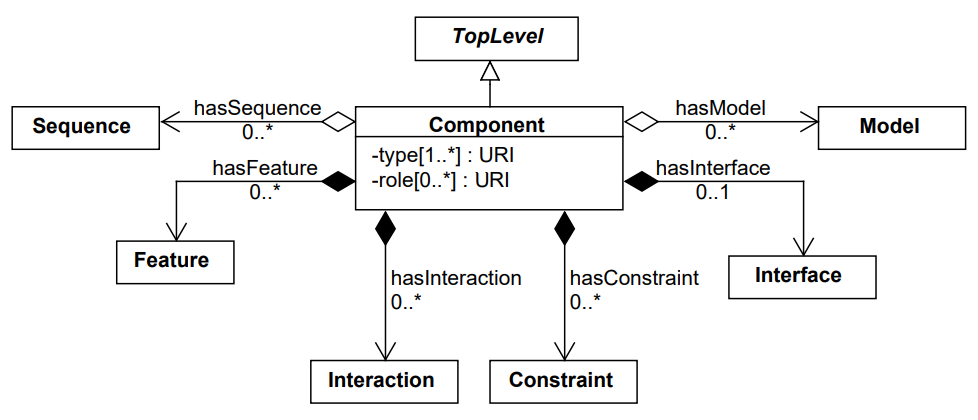

Getting Started with pySBOL3
=============================

This beginner’s guide introduces the basic principles of pySBOL3 for
new users. The examples discussed in this guide are excerpted
from the Jupyter notebook (`pySBOL3/examples/getting_started.ipynb <https://github.com/SynBioDex/pySBOL3/tree/main/examples/getting_started.ipynb>`_). 
The objective of this documentation is to
familiarize users with the basic patterns of the API. For more
comprehensive documentation about the API, refer to documentation
about specific classes and methods.

The class structure and data model for the API is based on the
Synthetic Biology Open Language. For more detail about the SBOL
standard, visit `sbolstandard.org <https://sbolstandard.org>`_ or
refer to the `specification document
<https://sbolstandard.org/datamodel-specification/>`_. This
document provides diagrams and description of all the standard classes
and properties that comprise SBOL.

-------------------------
Creating an SBOL Document
-------------------------

In a previous era, engineers might sit at a drafting board and draft a
design by hand. The engineer's drafting sheet in pySBOL2 is called a
Document. The Document serves as a container, initially empty, for
SBOL data objects which represent elements of a biological
design. Usually the first step is to construct a Document in which to
put your objects. All file I/O operations are performed on the
Document. The Document `read
<autoapi/sbol3/document/index.html#sbol3.document.Document.read>`_ and
`write
<autoapi/sbol3/document/index.html#sbol3.document.Document.write>`_
methods are used for reading and writing files in SBOL format.

.. code:: python

    >>> import sbol3
    >>> doc = sbol3.Document()
    >>> doc.read('simple_library.nt')
    >>> doc.write('simple_library_out.nt')

.. end

Reading a Document will wipe any existing contents clean before
import. 

A Document may contain different types of SBOL objects, including
ComponentDefinitions, ModuleDefinitions, Sequences, and Models. These
objects are collectively referred to as TopLevel objects because they
can be referenced directly from a Document. The total count of objects
contained in a Document is determined using the ``len`` function. To
view an inventory of objects contained in the Document, simply
``print`` it.

.. code:: python

    >>> len(doc)
    67
    >>> print(doc)
    Collection....................4
    CombinatorialDerivation.......6
    Component.....................33
    Sequence......................24
    ---
    Total: .........................67

.. end

Each SBOL object in a Document is uniquely identified by a special string of characters called a Uniform Resource Identifier (URI). A URI is used as a key to retrieve objects from the Document. To see the identities of objects in a Document, iterate over them using a Python iterator.

.. code:: python

    >>> for obj in doc.objects:
    ...     print(obj.identity)
    ...
    http://sbolstandard.org/testfiles/All_FPs
    http://sbolstandard.org/testfiles/FPs_small
    http://sbolstandard.org/testfiles/FPs_small_ins
    .
    .

.. end

These URIs are said to be **sbol-compliant**. An sbol-compliant URI consists of a namespace, an optional local path, and a display ID (``display_id``). In this tutorial, we use URIs of the type ``http://sbolstandard.org/testfiles/my_obj``, where the namespace is ``http://sbolstandard.org/testfiles``, and the display ID is ``my_object``.

Based on our inspection of objects contained in the Document above, we can see that these objects were all created in the namespace ``http://sbolstandard.org/testfiles``. Thus, in order to take advantage of SBOL-compliant URIs, we set an environment variable that configures this namespace as the default.

.. code:: python

    >>> sbol3.set_namespace('http://sbolstandard.org/testfiles')

.. end

Setting the namespace has several advantages. It simplifies object creation and retrieval from Documents. In addition, it serves as a way for a user to claim ownership of new objects. Generally users will want to specify a namespace that corresponds to their organization's web domain.

--------------------------
Creating SBOL Data Objects
--------------------------

Biological designs can be described with SBOL data objects, including both structural and functional features.  
The principle classes for describing the structure and primary sequence of a design are ``Component``, ``Sequence``, and ``Feature``. 
The principle classes for describing the function of a design are ``Component``, ``Feature``, ``Interaction``, and ``Participation``. 

In the `SBOL specification document <https://sbolstandard.org/datamodel-specification/>`_, classes and their properties are represented as box diagrams. Each box represents an SBOL class and its attributes. Following is an example of the diagram for the ``Component`` class which will be referred to in later sections. These class diagrams follow conventions of the Unified Modeling Language.

As introduced in the previous section, SBOL objects are identified by a uniform resource identifier (URI). When a new object is constructed, the user must assign a unique identity. The identity is ALWAYS the first argument supplied to the constructor of an SBOL object. 

Constructors for SBOL objects follow a predictable pattern. The first argument is an identifier, which can be either a full URI, a universally unique identifier (UUID), or a display ID (possibly with a local path). If the first argument to the constructor is a valid URI or UUID, the object is created with the URI or UUID as its ``identity``. Otherwise, the object is created with an ``identity`` composed of the first argument appended to the configured namespace (set using ``sbol3.set_namespace()``).
Constructors can take additional arguments, depending on whether the SBOL class has required attributes. Attributes are required if the specification says they are. In a UML diagram, required attributes are indicated as properties with a cardinality of 1 or more. For example, a ``Component`` (see the UML diagram above) has only one required attribute, ``types``, which specifies one or more molecular types for a component.  Required attributes MUST be specified when calling a constructor. 

The following code creates a protein component (``types`` set to ``SBO_PROTEIN``). 

.. code:: python

    >>> cas9 = sbol3.Component('Cas9', sbol3.SBO_PROTEIN)

.. end

The following code creates a DNA component (``types`` set to ``SBO_DNA``). 

.. code:: python

    >>> target_promoter = sbol3.Component('target_promoter', sbol3.SBO_DNA, roles=[sbol3.SO_PROMOTER])

.. end

The following code creates a DNA component with a local path (``/promoters/``), and another DNA component with a different namespace.

.. code:: python

    >>> # Include a local path in addition to a display_id
    >>> second_promoter = sbol3.Component('promoters/second_promoter', sbol3.SBO_DNA)
    >>>
    >>> # Use a namespace different from the configured default namespace
    >>> third_promoter = sbol3.Component('http://sbolstandard.org/other_namespace/third_promoter', sbol3.SBO_DNA)

.. end

For examples of how the first argument of the SBOL object constructor is used to assign the object's ``identity`` and ``display_id``, compare the following: 

.. code:: python

    >>> target_promoter.identity
    'http://sbolstandard.org/testfiles/target_promoter'
    >>> target_promoter.display_id
    'target_promoter'
    >>> second_promoter.identity
    'http://sbolstandard.org/testfiles/promoters/second_promoter'
    >>> second_promoter.display_id
    'second_promoter'
    >>> third_promoter.identity
    'http://sbolstandard.org/other_namespace/third_promoter'
    >>> third_promoter.display_id
    'third_promoter'

.. end

-----------------------------------------
Using Ontology Terms for Attribute Values
-----------------------------------------

Notice the ``Component.types`` attribute is specified using predefined constants (``sbol3.SBO_PROTEIN`` and ``sbol3.SBO_DNA`` in the examples above). The ``Component.types`` property is one of many SBOL attributes that uses ontology terms as property values.  The ``Component.types`` property uses the 
`Systems Biology Ontology (SBO) <https://bioportal.bioontology.org/ontologies/SBO/>`_
to be specific. Ontologies are standardized, machine-readable vocabularies that categorize concepts within a domain of scientific study. The SBOL 3.0 standard unifies many different ontologies into a high-level, object-oriented model.

Ontology terms also take the form of Uniform Resource Identifiers. Many commonly used ontological terms are built-in to pySBOL3 as predefined constants. If an ontology term is not provided as a built-in constant, its URI can often be found by using an ontology browser tool online. `Browse Sequence Ontology terms here <http://www.sequenceontology.org/browser/obob.cgi>`_ and `Systems Biology Ontology terms here <http://www.ebi.ac.uk/sbo/main/tree>`_. While the SBOL specification often recommends particular ontologies and terms to be used for certain attributes, in many cases these are not rigid requirements. The advantage of using a recommended term is that it ensures your data can be interpreted or visualized by other applications that support SBOL. However in many cases an application developer may want to develop their own ontologies to support custom applications within their domain.

The following example illustrates how the URIs for ontology terms can be easily constructed, assuming they are not already part of pySBOL3's built-in ontology constants.

.. code:: python

    >>> SO_ENGINEERED_FUSION_GENE = tyto.SO.engineered_fusion_gene
    >>> SO_ENGINEERED_FUSION_GENE
    'https://identifiers.org/SO:0000288'
    >>> SBO_DNA_REPLICATION = tyto.SBO.DNA_replication
    >>> SBO_DNA_REPLICATION
    'https://identifiers.org/SBO:0000204'

.. end

For more information on using ontology terms with pySBOL3, see: `Using Ontology Terms <ontology.html>`_.

----------------------------------------------------
Adding, Finding, and Getting Objects from a Document
----------------------------------------------------

In some cases a developer may want to use SBOL objects as intermediate data structures in a computational biology workflow. In this case, the user is free to manipulate objects independently of a Document. However, if the user wishes to write out a file with all the information contained in their object, they must first add it to the Document. This is done using the ``add`` method.

.. code:: python

    >>> doc.add(target_promoter)
    >>> doc.add(cas9)

.. end

Objects can be found and retrieved from a Document by using the ``find`` method. This method can take either the object's ``identity`` (i.e., full URI) or ``display_id`` (local identifier) as an argument.

.. code:: python

    >>> cas9.identity
    'http://sbolstandard.org/testfiles/Cas9'
    >>> found_obj = doc.find('http://sbolstandard.org/testfiles/Cas9')
    >>> found_obj.identity
    'http://sbolstandard.org/testfiles/Cas9'
    >>> cas9.display_id
    'Cas9'
    >>> found_obj = doc.find('Cas9')
    >>> found_obj.identity
    'http://sbolstandard.org/testfiles/Cas9'

.. end

It is possible to have multiple SBOL objects with the same ``display_id`` (but different ``identity``) in the same document. In that case, if the ``find`` method is called with the ``display_id`` as the argument, it will return the matching object that was added to the document first.

.. code:: python

    >>> cas9a = sbol3.Component('http://sbolstandard.org/other_namespace/Cas9', sbol3.SBO_PROTEIN)
    >>> cas9a.identity
    'http://sbolstandard.org/other_namespace/Cas9'
    >>> cas9a.display_id
    'Cas9'
    >>> doc.add(cas9a)
    >>> found_obj = doc.find('Cas9')
    >>> found_obj.identity
    'http://sbolstandard.org/testfiles/Cas9'
    >>> found_obj = doc.find('http://sbolstandard.org/other_namespace/Cas9')
    >>> found_obj.identity
    'http://sbolstandard.org/other_namespace/Cas9'

.. end

---------------------------------------------
Getting, Setting, and Editing Attributes
---------------------------------------------

The attributes of an SBOL object can be accessed like other Python class objects, with a few special considerations. For example, to get the values of the ``display_id`` and ``identity`` properties of any object :

.. code:: python

    >>> print(cas9.display_id)
    Cas9
    >>> print(cas9.identity)
    http://sbolstandard.org/testfiles/Cas9

.. end

Note that ``display_id`` gives only the shorthand, local identifier for the object, while the ``identity`` property gives the full URI.

The attributes above return singleton values. Some attributes, like ``Component.roles`` and ``Component.types`` support multiple values. Generally these attributes have plural names. If an attribute supports multiple values, then it will return a list. If the attribute has not been assigned any values, it will return an empty list.

.. code:: python

    >>> cas9.types
    ['https://identifiers.org/SBO:0000252']
    >>> cas9.roles
    []

.. end

Setting an attribute follows the ordinary convention for assigning attribute values:

.. code:: python

   >>> cas9.description = 'This is a Cas9 protein'

.. end

To set multiple values:

.. code:: python

    >>> plasmid = sbol3.Component('pBB1', sbol3.SBO_DNA)
    >>> plasmid.roles = [ sbol3.SO_DOUBLE_STRANDED, sbol3.SO_CIRCULAR ]

.. end

Properties such as ``types`` and ``roles`` behave like Python lists, and list operations like ``append`` and ``extend`` will work directly on these kind of attributes:

.. code:: python

    >>> plasmid.roles = [ sbol3.SO_DOUBLE_STRANDED ]
    >>> plasmid.roles.append( sbol3.SO_CIRCULAR )
    
    >>> plasmid.roles = []
    >>> plasmid.roles.extend( [sbol3.SO_DOUBLE_STRANDED, sbol3.SO_CIRCULAR] )
    
    >>> plasmid.roles = [ sbol3.SO_DOUBLE_STRANDED ]
    >>> plasmid.roles += [ sbol3.SO_CIRCULAR ]

.. end

To clear all values from an attribute, set it to an empty list:

.. code:: python

    >>> plasmid.roles = []

.. end

------------------------------------------
Creating and Adding Child Objects
------------------------------------------

Some SBOL objects can be composed into hierarchical parent-child relationships.  
In the specification diagrams, these relationships are indicated by black diamond arrows.  
In the UML diagram above, the black diamond indicates that Components are parents of Features.  
In pySBOL3, properties of this type are created as subcomponents and then added to the appropriate 
list attribute of the parent component. The constructor for the ``SubComponent`` class 
takes a ``Component`` as its only required argument. In this usage, the ``Component`` is "... analogous 
to a blueprint or specification sheet for a biological part..." Whereas the ``SubComponent`` "... represents 
the specific occurrence of a part..." within a larger design 
(`SBOL version 3.0.0 specification document <https://sbolstandard.org/docs/SBOL3.0specification.pdf>`_). 
For example, to add a promoter to a circuit design, first define the promoter and circuit as SBOL 
``Component`` objects, then define a ``SubComponent`` as an instance of the promoter and add that 
``SubComponent`` to the circuit's ``features`` attribute:

.. code:: python

    >>> ptet = sbol3.Component('pTetR', sbol3.SBO_DNA, roles=[sbol3.SO_PROMOTER])
    
    >>> circuit = sbol3.Component('circuit', sbol3.SBO_DNA, roles=[sbol3.SO_ENGINEERED_REGION])
    
    >>> ptet_sc = sbol3.SubComponent(ptet)
    >>> circuit.features += [ptet_sc]

.. end

-----------------------------------------
Working with SubComponent Locations
-----------------------------------------

In order to specify the exact range (start and end positions) on the parent component sequence where the child
component is located, use the ``Range`` class. The ``Range`` class takes two required arguments, ``start`` and
``end``, which are the start and end positions of the child component on the parent component sequence.
The ``Range`` class also takes an optional argument, ``sequence``, which is the sequence of the child component.
The ``Range`` class is then used as the value of the ``locations`` attribute of the ``SubComponent``.
Example for a DNA component with a DNA SubComponent:

.. code:: python

    # seq is the sequence of the parent component
    >>> start = 1
    >>> end = 44
    >>> sub_sequence = sbol3.Sequence("PromoterSeq", elements=seq.elements[start - 1 : end - 1])
    >>> range_location = sbol3.Range(start=start, end=end, sequence=sub_sequence)
    >>> subcomponent = sbol3.SubComponent(component, name="Promoter1", roles=[sbol3.SO_PROMOTER], locations=range_location)

.. end

-----------------------------------------
Creating and Editing Reference Properties
-----------------------------------------

Some SBOL objects point to other objects by way of URI references. For example, Components point to their corresponding Sequences by way of a URI reference. These kind of properties correspond to white diamond arrows in UML diagrams, as shown in the figure above. Attributes of this type contain the URI of the related object.

.. code:: python

    >>> gfp = sbol3.Component('GFP', sbol3.SBO_DNA)
    >>> doc.add(gfp)
    >>> gfp_seq = sbol3.Sequence('GFPSequence', elements='atgnnntaa', encoding=sbol3.IUPAC_DNA_ENCODING)
    >>> doc.add(gfp_seq)
    >>> gfp.sequences = [ gfp_seq ]
    >>> print(gfp.sequences)
    ['http://sbolstandard.org/testfiles/GFPSequence']
    >>> # Look up the sequence via the document
    >>> seq2 = gfp.sequences[0].lookup()
    >>> seq2 == gfp_seq
    True

.. end

Note that assigning the ``gfp_seq`` object to the ``gfp.sequences`` actually results in assignment of the object's URI. An equivalent assignment is as follows:

.. code:: python

    >>> gfp.sequences = [ gfp_seq.identity ]
    >>> print(gfp.sequences)
    ['http://sbolstandard.org/testfiles/GFPSequence']
    >>> seq2 = gfp.sequences[0].lookup()
    >>> seq2 == gfp_seq
    True

.. end

Also note that the DNA sequence information is saved as the ``elements`` attribute of the ``Sequence`` object, as per the SBOL 3 specification:

.. code:: python

    >>> gfp_seq.elements
    'atgnnntaa'

.. end

--------------------------------------
Iterating and Indexing List Properties
--------------------------------------

Some SBOL object properties can contain multiple values or objects. You may iterate over those list properties as with normal Python lists:

.. code:: python

    >>> # Iterate through objects (black diamond properties in UML)
    >>> for feat in circuit.features:
    ...     print(f'{feat.display_id}, {feat.identity}, {feat.instance_of}')
    ...
    SubComponent1, http://sbolstandard.org/testfiles/circuit/SubComponent1, http://sbolstandard.org/testfiles/pTetR
    SubComponent2, http://sbolstandard.org/testfiles/circuit/SubComponent2, http://sbolstandard.org/testfiles/op1
    SubComponent3, http://sbolstandard.org/testfiles/circuit/SubComponent3, http://sbolstandard.org/testfiles/RBS1
    .
    .

.. end

.. code:: python

    >>> # Iterate through references (white diamond properties in UML)
    >>> for seq in gfp.sequences:
    ...     print(seq)
    ...
    http://sbolstandard.org/testfiles/GFPSequence

.. end

Numerical indexing of list properties works as well:

.. code:: python

    >>> for n in range(0, len(circuit.features)):
    ...     print(circuit.features[n].display_id)
    ...
    SubComponent1
    SubComponent2
    SubComponent3
    .
    .

.. end

----------------------------------
Copying Documents and Objects
----------------------------------

Copying a ``Document`` can result in a few different ends, depending
on the user's goal. The first option is to create a simple copy of the
original ``Document`` with ``Document.copy``. After copying, the
object in the ``Document`` clone has the same identity as the object
in the original ``Document``.

.. code:: python

    >>> import sbol3
    >>> sbol3.set_namespace('https://example.org/pysbol3')
    >>> doc = sbol3.Document()
    >>> cd1 = sbol3.Component('cd1', types=[sbol3.SBO_DNA])
    >>> doc.add(cd1)
    <sbol3.component.Component object at 0x7fb7d805b9a0>
    >>> for o in doc:
    ...     print(o)
    ... 
    <Component https://example.org/pysbol3/cd1>
    >>> doc2 = doc.copy()
    >>> for o in doc2:
    ...     print(o)
    ... 
    <Component https://example.org/pysbol3/cd1>
    >>> cd1a = doc2.find('cd1')
    >>> 
    >>> # The two objects point to different locations in memory, they are different objects with the same name.
    >>> 
    >>> cd1a
    <sbol3.component.Component object at 0x7fb7c83e7c40>
    >>> cd1
    <sbol3.component.Component object at 0x7fb7d805b9a0>

.. end

The ``sbol3.copy`` function is a more powerful way to copy or clone
objects. ``Document.copy`` is built on ``sbol3.copy``. The
``sbol3.copy`` function lets a user copy objects as above. It also
lets the user change object namespaces and add the new documents to an
existing ``Document``.

For example, if a user wants to copy objects and change the namespace
of those objects, a user can use the ``into_namespace`` argument to
``sbol3.copy``. Following on from the example above:

.. code:: python

    >>> objects = sbol3.copy(doc, into_namespace='https://example.org/foo')
    >>> len(objects)
    1
    >>> for o in objects:
    ...     print(o)
    ... 
    <Component https://example.org/foo/cd1>
    >>> 

.. end

Finally, if a user wants to construct a new set of objects and add
them to an existing ``Document`` they can do so using the
``into_document`` argument to ``sbol3.copy``. Again, following on from
the example above:

.. code:: python

    >>> doc3 = sbol3.Document()
    >>> len(doc3)
    0
    >>> # Any iterable of TopLevel can be passed to sbol3.copy:
    >>> sbol3.copy([cd1], into_namespace='https://example.org/bar', into_document=doc3)
    [<sbol3.component.Component object at 0x7fb7d844aa60>]
    >>> len(doc3)
    1
    >>> for o in doc3:
    ...     print(o)
    ... 
    <Component https://example.org/bar/cd1>
    >>> 

.. end

.. Import and export from other formats is still under development, see issues #65 and #66; so I'm commenting out this section for now.

    ---------------------------------------------
    Converting To and From Other Sequence Formats
    ---------------------------------------------

    It is possible to convert SBOL to and from other common sequence
    formats. Conversion is performed by calling the `online converter tool
    <https://validator.sbolstandard.org/>`_ , so an internet connection is
    required. Currently the supported formats are `SBOL2`, `SBOL1`,
    `FASTA`, `GenBank`, and `GFF3`. The following example illustrates how
    to export these different formats. Note that conversion can be lossy.

    .. TODO: Add example of importFromFormat. See Issue #329
    ..   * Add "and import" to the sentence above
    ..   * Add to the example below
    ..  >>> doc.importFromFormat('GenBank', 'parts.gb')

    This example uses
    `parts.xml <https://raw.githubusercontent.com/SynBioDex/pySBOL2/master/test/resources/tutorial/parts.xml>`_
    from the pySBOL2 repository.

    .. code:: python

      >>> from sbol2 import *
      RDFLib Version: 5.0.0
      >>> doc = Document('parts.xml')
      >>> doc.exportToFormat('GenBank', 'parts.gb')

    .. end

    N.B. Importing from other formats has
    `not been implemented in pySBOL2 <https://github.com/SynBioDex/pySBOL2/issues/329>`_
    yet.

.. TODO: Un-comment the next section (and edit?) when the page it links to is done.

    ----------------------------------
    Creating Biological Designs
    ----------------------------------

    This concludes the basic methods for manipulating SBOL data structures. Now that you're familiar with these basic methods, you are ready to learn about libSBOL's high-level design interface for synthetic biology. See `SBOL Examples <sbol_examples.html>`_.
